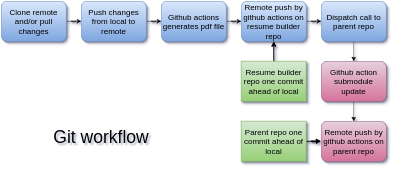

# Resume builder

Automate resume generration based on <b>deedy resume</b> and create a static url for the generrated <b>.pdf</b> file.

## What's going on?

- Resume builder is based on the popular resume template by [deedy](https://github.com/deedy/Deedy-Resume).
- Once you make changes to the source file(<b>.tex</b>) in your preferred editor and push, it generates the output pdf file in the repo itself. Then you may add the repo as a submodule to your other git repo or embed the file in your project.
  

## How to replicate?

- Fork the repo locally.
- Make changes in the source file(<b>.tex</b>).
- Add the repo as a submodule to the parent repo.
- Create a [PAT](https://docs.github.com/en/github/authenticating-to-github/creating-a-personal-access-token) and add it is a secret to both, the parent repo and the resume-builder repo.
- Update the workflow files if necessary. 
  (Check the workflow file for more details.)
- Push changes.
- The pdf file is genrated automatically on push using github actions.
- A dispatch call is made to the parent repo to update this repo as asubmodule.

## Notes

- The pdf file is generated using xelatex.
- For publications to work compile the <b>.tex</b> first. Then compile <b>.bib</b> file. Then compile <b>.tex</b> again.
- Remember to pull changes before commiting changes again since <b>.pdf</b> file gets uploaded to the same branch.
- Check my other [repo](https://github.com/akss13/akss13.github.io) for the workflow file on the parent repo.
- Checkout these github actions used for more details:
    - [latex-action](https://github.com/xu-cheng/latex-action)
    - [repository-dispatch](https://github.com/peter-evans/repository-dispatch)